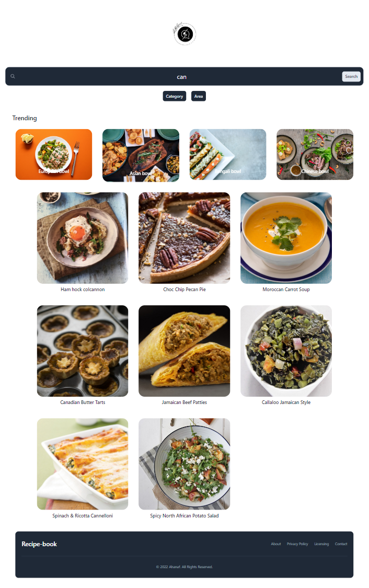

# Over view

Do you enjoy cooking? If yes then you know how hard it is to find the perfect recipe. This app was created with the goal to ease your tantrum so you can focus on your cooking.
The main objectives of this website are following

## Demo

Live Preview: https://javascript-recipe-book.netlify.app

## Installation

To clone and run this application, you'll need
[Git](https://github.com/git/git-scm.com)
and Node.js (which comes with npm)
installed on your computer. From your command line:

```bash
# Clone this repository
$ git clone https://github.com/AhanafVai/recipe-book.git

# Go into the repository
$ cd filename

# Install dependencies
$ npm install


## Feedback

Want to contribute? Great!

To fix a bug or enhance an existing module, follow these steps:

- Fork the repo
- Create a new branch (`git checkout -b 'improve-feature'`)
- Make the appropriate changes in the files
- Add changes to reflect the changes made
- Commit your changes (`git commit -am 'Improve feature'`)
- Push to the branch (`git push origin 'improve-feature'`)
- Create a Pull Request

## Bug / Feature Request

If you find a bug (the website couldn't handle the query
and / or gave undesired results),
kindly open an issue [here](https://github.com/AhanafVai/recipe-book/issues)
by including your search query and the expected result.

If you'd like to request a new function, feel free
to do so by opening
an issue [here](https://github.com/AhanafVai/recipe-book/issues).
Please include sample queries and their corresponding results.

### Key features

- Dynamic search
- Responsive support
- Dynamic search area/category
- Cross platform

## Tech Stack

**Frontend:** `Semantic HTML` `TailwindCSS` `Javascript` `Swiper JS`

## Todos

- Adding pagination(In progress)

- About section(Planing)

## Acknowledgements

### Design Inspiratrion

- [Dev ed](https://www.youtube.com/c/DevEd)

### Technical helpers

- Google
-stack overflow

## License

[MIT](https://choosealicense.com/licenses/mit/)
|
GitHub: [@AhanafVai](https://github.com/AhanafVai)
|
LinkedIn: [Ahanaf Abdullah](https://www.linkedin.com/in/ahanafabdullah9/)
```
